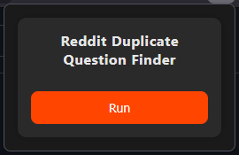
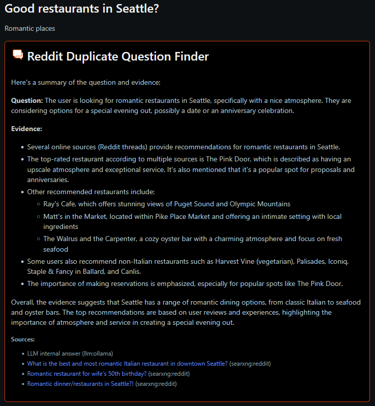

# Project Description
The purpose of this project is to serve as Reddit Duplicate Question Finder.

The frontend is a Firefox browser extension. After loading a Reddit page, the extension may be ran to begin a search for answers on Reddit or other sources to find similar questions asked and previous answers to the question.

For more information on the frontend such as how to install and run, see the [browser-plugin/README.md](browser-plugin/README.md).

For more information on the backend such as how to install and run, see the [app/README.md](app/README.md).

# Implementation Information
## Summary
There are two portions of the tool, a frontend and a backend. The tool offers ways to expand upon areas, such as having a backend allows for the client to be a JavaScript browser extension, or any other future application that may be warranted. In addition, the backend has capabilities to expand upon supported LLMs for query generation, searching and summarization. In addition, searching can be expanded to use additional search APIs for retrieving duplicate posts. The reason for adding the ability to expand is due to Reddit recently locking down their API access and requiring an approval from administrators. For this project, gaining access to the Reddit API was denied.

At a high level, the frontend is a JavaScript browser extension and the backend is a Python web API. The backend default implementation uses Ollama, SearXNG, and ArcticShift. A focus for the default set of tooling was to keep it free, so the development effort would incur no cost. Ollama is a free LLM created by Meta. SearXNG is a free search API that has a engine to search Reddit. ArcticShift is a free API used to retrieve comments from historical Reddit posts.

## Frontend
The frontend is a JavaScript browser extension that shows a button to run the content. It only works on Reddit pages that have a topic and body. Since the tool doesn't have a way to verify that the content is a question, it is expected that the user will run the tool on content that they assume will have been asked previously.

To run the tool, you click the Run button.

The frontend works by scraping the current Reddit page and gathers the following information:
- Topic Title
- Topic Body
- URL
- Subreddit Name

This information is sent to the backend for processing.

After processing, the frontend receives the result and displays it under the topic body of the Reddit post. It will include information of the answers to the question and include the sources of the context.

## Backend
#### Overview
The backend is a Python web API that allows a question, content and some other information to be sent to. There are multiple endpoints depending on what the developer or user are attempting to accomplish. These endpoints are located in [app\main.py](app\main.py).

#### Endpoints
- POST /generate_queries - endpoint to return the query words and questions generated
- POST /generate_search - endpoint to return the search results (generates query words and searchs)
- POST /generate_summary - endpoint to return the summary (full end-to-end, used for frontend)

#### Components
The backend is broken up into three main components:
1. Query
2. Search
3. Summary

For more information on the backend components, see the [app/README.md](app/README.md).

#### Default Implementation
The following end-to-end workflow is used in the default implementation.

After POST /generate_summary is called, the query generation will be ran.

The default [Ollama query provider](app\providers\query\ollama\query_provider.py) will feed the question and content into Ollama, which will generate a keyword string and sub-questions for searching.

Then, two default search providers will run. One is the [Ollama search provider](app\providers\search\ollama\search_provider.py) and the [SearXNG search provider](app\providers\search\searxng\search_provider.py).

The Ollama search provider is straight-forward and will feed the query into the LLM to get an answer. SearXNG will use the query string to search for posts on Reddit that are similar. Due to issues with the resulting posts not being fully relevant, the list of results are narrowed down to the top 3 by relevancy with Ollama. ArcticShift is used to retrieve the top comments of those posts and appends it to the result information.

After all the search providers complete their search, the default [Ollama summary provider](app\providers\summary\ollama\summary_provider.py) is given the resulting list of search results, and then generates an overall summary to provide high-level information of everything found.

Finally, the resulting summary and sources are returned to the caller to be displayed for the user.

#### Expansion
The application was written with expansion and ease of change of the internal tools in mind. This allows the tool to support other LLMs such as ChatGPT or Claude, or other search API's like Google or Bing.

The main file for extending the application is the [config.py](app\core\config.py) file. In the section where QUERY_PROVIDERS, SEARCH_PROVIDERS and SUMMARY_PROVIDERS are formed, there is a template for each provider to follow in order to be used. The default_selection can be changed after to use the new provider. Note that QUERY_PROVIDERS and SUMMARY_PROVIDERS only support a single provider, as there isn't really any reason to use multiple providers for this portion. SEARCH_PROVIDERS support multiple providers that all run after another, so the breadth of a search can expand a wide range and improve the final content.

After the information is added to the config.py template, a developer would need to extend one of the provider folder's base.py class and override the function with their implementation. Once that is finished, the application will begin using the new provider.

# Final Notes
The software is not perfect and will not generate relevant answers for every question on Reddit. There are cases where certain questions will easily find previous Reddit questions for a result, but there are also cases where the tool does not find relevant historic Reddit posts to provide context.

In terms of addressing these issues, further improvement could be made by using optimized search engines like Google to find more relevant content. Query generation may also be improved with tools like ChatGPT. The Reddit API may also be used if one were to be approved access. In addition, multiple queries and feedback from results can be done to improve relevant topics but that would also require higher external API usage.